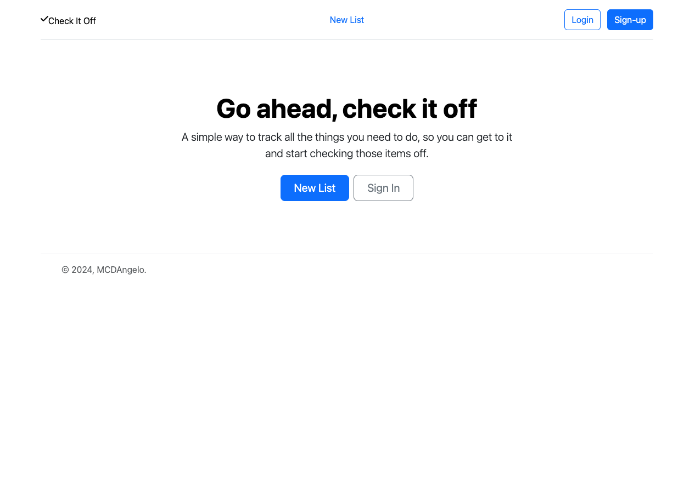
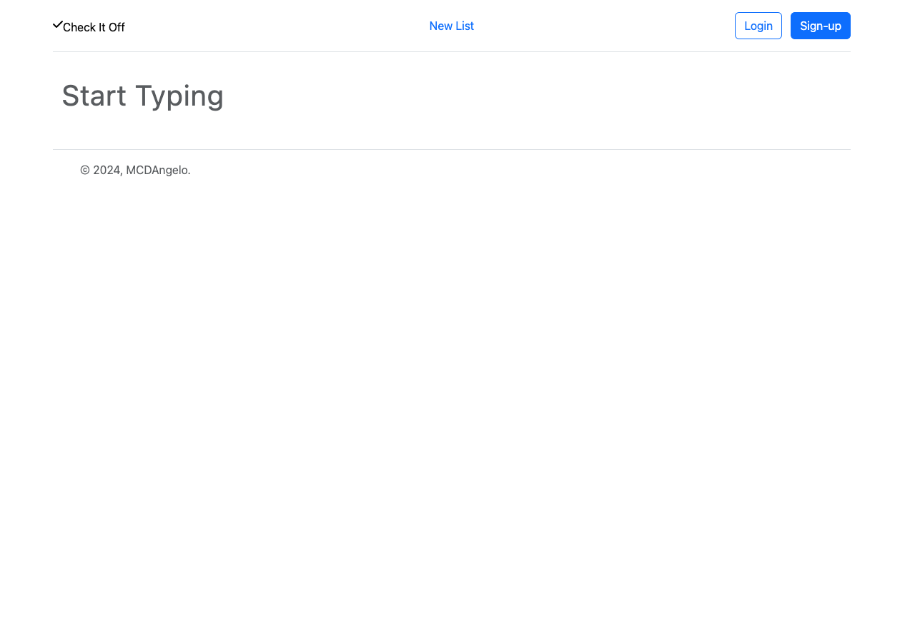
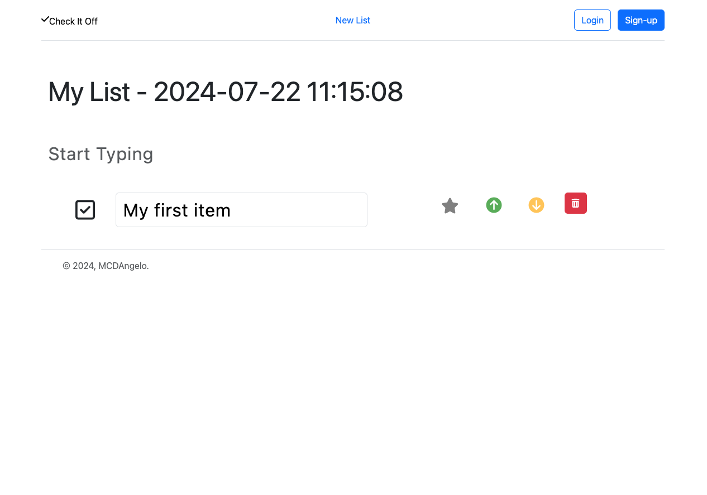
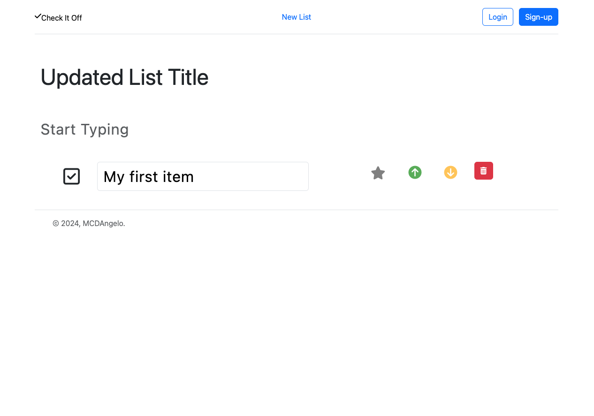
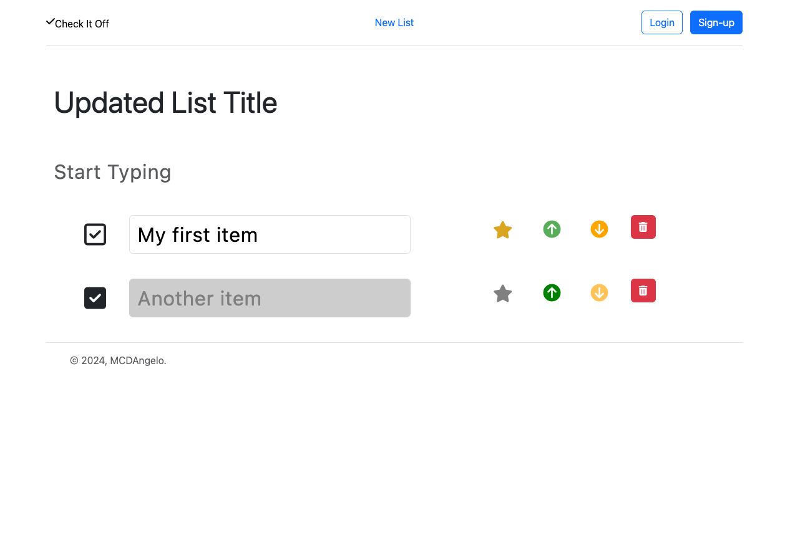
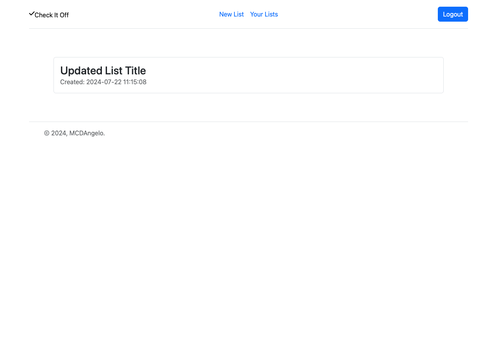

# To Do List Website

A website to keep track of all of your to do's!

Future versions will:
* add styling on the user's lists page to indicate which lists have been completed and how many outstanding items are left on each list.
* allow users to mark lists as private (logged in users only)
* allow users to delete lists
* re-work the UI so new items are added to the bottom of the list

## Screenshots

